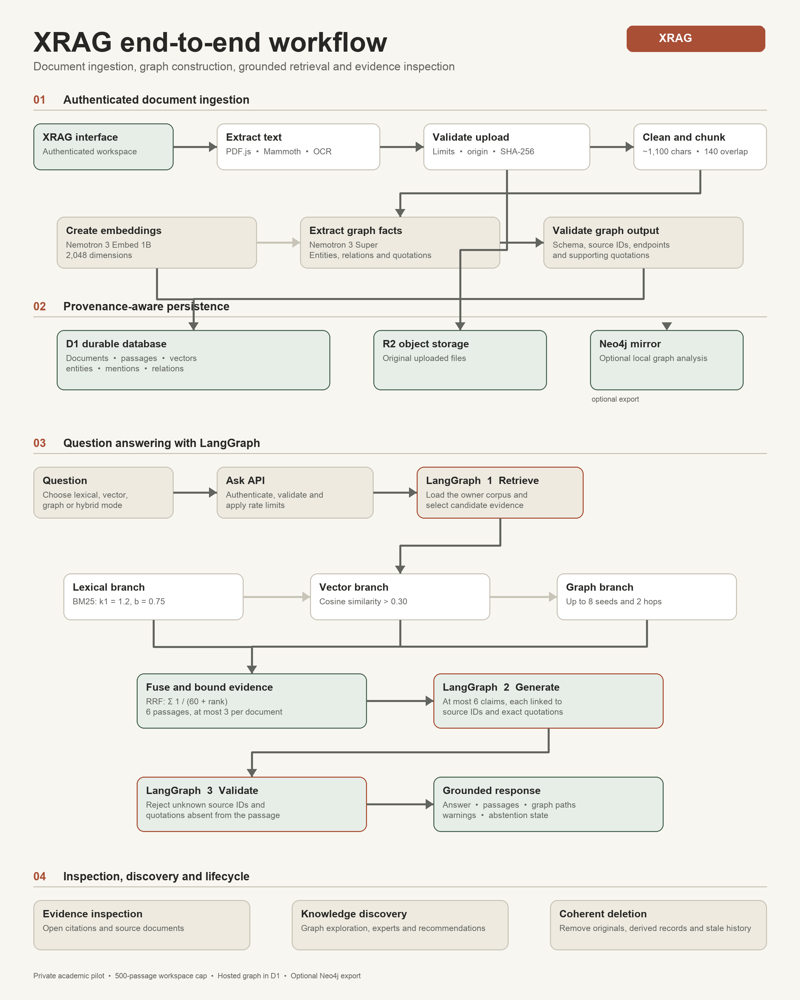
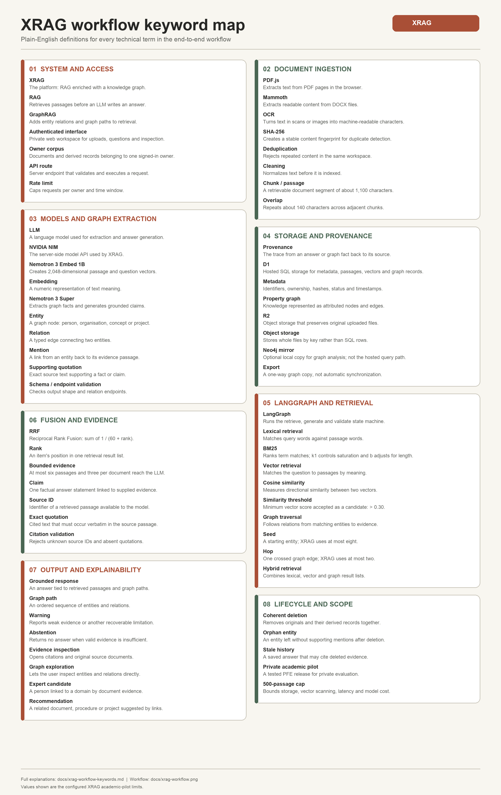

# XRAG Enterprise Knowledge

English PFE implementation for **Daoudi Ahmed Khalil**, **MDSE**, École Hassania des Travaux Publics, supervised by **EL GHAZI**, academic year **2025/2026**.

XRAG indexes documents, extracts an evidence-linked property graph, and answers questions through lexical, semantic, graph, or hybrid retrieval. The interface includes source inspection, graph exploration, documented expert candidates, related documents, original downloads, and saved questions. Uploaded text is sent to NVIDIA for embeddings, extraction, and generation.

## Run locally

Requires Node.js 22.13+ and npm.

```sh
npm ci
cp .env.example .dev.vars
# Set NVIDIA_API_KEY in .dev.vars. Do not commit it.
npm run db:local
npm run dev -- --host 127.0.0.1
```

Open the Local URL printed by the server. Local sign-in is simulated only for loopback access by the starter's development middleware. Never expose the development server to the internet. The hosted app uses Sites authentication and owner-only access; the application trusts authenticated identity headers supplied by that gateway. A different hosting environment must provide an equivalent trusted gateway that strips user-supplied identity headers.

## Verification

```sh
npm run typecheck
npm test
npm run build
# Requires the local Kaggle test sample described in ../DETAILS/test-data/manifest.json:
node scripts/integration-test.mjs
node --import tsx scripts/evaluate.ts
```

The test scripts perform real NVIDIA calls and may consume provider quota. The integration test expects a clean local corpus. Test documents are local only and are excluded from the hosted build and GitHub repository. Evidence summaries are in `../DETAILS`.

## Architecture

The [OTHER IDEAS roadmap](OTHER_IDEAS.md) lists prioritized improvements for retrieval, ingestion, knowledge graphs, grounded generation, security, scale, evaluation, operations, UX, and research experiments including Jev.



The [workflow glossary](docs/xrag-workflow-keywords.md) explains every technical term used in the diagram. A [visual keyword map](docs/xrag-workflow-keywords.png) provides the same definitions as a companion PNG. The editable Mermaid source is in [`docs/xrag-workflow.mmd`](docs/xrag-workflow.mmd). Regenerate the images with `python3 scripts/render-workflow.py` and `python3 scripts/render-workflow-keywords.py` using Python with Pillow installed.



### French learning materials

- [French workflow PNG](docs/xrag-workflow-fr.png) and [editable Mermaid source](docs/xrag-workflow-fr.mmd)
- [French keyword map PNG](docs/xrag-workflow-keywords-fr.png) and [complete French glossary](docs/xrag-workflow-keywords-fr.md)
- [French image renderers](scripts/render-workflow-fr.py) for the workflow and [`render-workflow-keywords-fr.py`](scripts/render-workflow-keywords-fr.py) for the keyword map

### Complete beginner courses

- [English PDF course](docs/XRAG_Full_Course_Zero_to_100_EN.pdf) and [editable English source](docs/xrag-course-en.md)
- [French PDF course](docs/Cours_Complet_XRAG_De_Zero_A_100_FR.pdf) and [editable French source](docs/xrag-course-fr.md)

The two course editions teach the project from files, HTTP, databases, LLMs, and RAG through the exact XRAG ingestion, graph, retrieval, LangGraph, validation, testing, deployment, and production-boundary decisions. The English edition contains 44 A4 pages and the French edition contains 43 A4 pages.

### Responsibility pipeline

The [actor pipeline PNG](docs/xrag-actor-pipeline.png) separates the work done by the user, browser tools, deterministic XRAG code, NVIDIA models, and data infrastructure. The [written English walkthrough](docs/xrag-actor-pipeline.md) gives the exact component and output for each of its 21 steps. Matching [French PNG](docs/xrag-actor-pipeline-fr.png) and [French walkthrough](docs/xrag-actor-pipeline-fr.md) versions are included. Regenerate both PNGs with `python3 scripts/render-actor-pipeline.py` using Python with Pillow installed.

React/Vinext and TypeScript run on Cloudflare Workers. D1 holds metadata, passages, embeddings, and a SQL property graph. R2 preserves originals. LangGraph orchestrates retrieval, generation, and citation validation. NVIDIA models are selected by environment variables; the verified release uses `nvidia/nemotron-3-super-120b-a12b` and `nvidia/nemotron-3-embed-1b` (2048 dimensions).

Passages are at most 1100 characters with roughly 140 characters of overlap. Hybrid retrieval uses reciprocal rank fusion with constant 60 over lexical BM25-style, vector cosine, and bounded two-hop graph rankings. The model receives at most six source passages. Citation identifiers and exact supporting quotations are validated; semantic entailment still requires human review.

The hosted graph is D1-backed. It is a bounded GraphRAG implementation, not a full implementation of Microsoft's community-summary GraphRAG pipeline. Neo4j is an optional local export mirror and does not serve the deployed query path.

## Supported imports

PDF text extraction with PDF.js, DOCX extraction with Mammoth, UTF-8 TXT/MD/CSV/JSON, and optional English OCR using Tesseract. Browser PDF rendering/OCR is bounded to 100 pages, 8 MB, and 40,000 extracted characters. CSV and JSON are treated as text rather than a typed relational dataset. Complex tables, handwriting, mixed languages, and poor scans need additional review.

The application bounds a private workspace to 500 passages. Vectors are scanned in memory; a production deployment with a larger corpus needs an ANN vector index, a durable ingestion queue, capacity testing, and organisation-specific access controls. D1 batches make structured indexing atomic; R2 operations use compensation, not a distributed transaction.

## Automatic folder collection

```sh
python3 scripts/collect.py /absolute/path/to/text-documents --local --watch 60
```

The collector polls TXT/MD/CSV/JSON documents and uses server-side SHA-256 deduplication. A changed file becomes a new document version; remove the obsolete version deliberately. For a trusted non-local gateway, configure `N6_INGEST_URL`, `N6_INGEST_TOKEN`, `INGEST_TOKEN`, and `INGEST_OWNER_ID`. The Sites private gateway still requires an approved machine-access path. The release does not create a gateway bypass token.

## Neo4j with Docker

```sh
export NEO4J_PASSWORD='set-a-long-unique-password'
docker compose up -d
python3 -m venv .venv
.venv/bin/pip install -r requirements-neo4j.txt
# Download Export graph from the authenticated interface.
NEO4J_URI=bolt://127.0.0.1:7687 NEO4J_USER=neo4j .venv/bin/python scripts/neo4j_import.py /path/to/xrag-knowledge-graph.json
```

The importer performs idempotent MERGE operations in a transaction. It does not delete stale content or automatically synchronise deletions. Its local ports bind to loopback. Graph exports contain document text: protect them as carefully as the originals.

## Deployment and operations

The production target is the registered Sites project in `.openai/hosting.json`. Commit source, validate the build, push its exact revision to the source repository, package `dist`, save the version, then deploy privately. Configure secrets through the hosting environment, not the manifest. Migrations are generated with Drizzle and applied before Worker publication. Never edit an already applied migration.

`GET /api/health` checks authentication, a database table, and model configuration; it is not a live provider availability probe. Other routes: `/api/documents`, `/api/documents/:id`, `/api/ask`, `/api/graph`, `/api/experts`, `/api/recommendations`, `/api/history`, `/api/export`. Owner checks apply to all routes. Imports are limited to 5/minute and questions to 12/minute per owner. No source text or credentials are written to server logs.

Delete removes original bytes, passages, dependent edges/mentions, orphan entities, and all saved question history for that owner. If R2 deletion fails, the operation stops before database deletion and can be retried. A crash between storage steps can leave an incomplete original-file state; a reconciliation process remains necessary for enterprise operations.

`Dockerfile` packages a local Workers rehearsal. Authentication is intentionally not bypassed in that container. Use the Sites gateway for the deployed product. The Docker Compose file provides the separate Neo4j analysis service.

## Production acceptance boundary

This release is a tested private academic pilot, not independently certified enterprise software. Before confidential organisation-wide use: validate the real corpus and permissions, agree provider processing terms, configure membership policy, test backup restoration and incident response, run concurrency/load tests and a security review, and perform independent human evaluation. Exact implemented limits and unverified items accompany the report. Do not interpret passing engineering tests as proof of answer correctness or general GraphRAG superiority.

The product name is **XRAG**. Existing deployment URLs, graph format `n6-graph-v1`, Neo4j labels, and `N6_*` collector variables retain their initial identifiers for compatibility. The academic report, presentation, and learning guide are delivered in the sibling RAG folders and in the private GitHub release pack.
